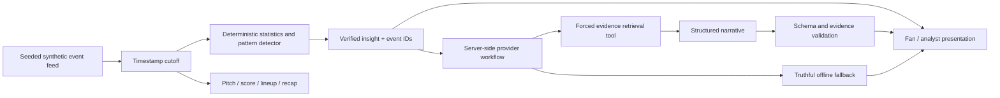

# Second Look

**You saw the game. Here’s what you missed.**

Second Look is a second-screen football intelligence experience. It turns synthetic match events into a small number of explainable stories, then lets viewers inspect the actions behind each claim. Built for an individual entry in Microsoft’s 2026 Inside the Game Developer Hackathon.

## The problem

Watching football and understanding how a match is changing are different things. A wall of statistics does little to bridge that gap. Second Look connects an observation, its supporting events, a tactical visualization, and a cautious explanation in one interaction.

## What works

- A responsive match centre with original Harbor Athletic and Riverside FC identities, alongside the supplied Second Look v1 brand system. No club crests, player photos, or broadcast footage.
- Three deterministic seeded fixtures: increasing pressure, post-substitution changes, and a quiet match.
- Play/pause, restart, seek, five playback speeds, scenario selection, and repeatable demo reset at 63:24.
- An interactive SVG pitch: actual event positions, numbered possession sequences, pass/shot endpoints, and progressive sequence replay. No invented tracking.
- Event-derived score, attempts, shots on target, pass completion, high ball wins, and synthetic chance probabilities.
- Pattern detection for attacking-third ball wins, shot frequency, and passing activity, with equal 15-minute comparison windows and supporting event IDs.
- Fan mode, analyst mode, timestamp-safe Catch Me Up, lineups, and player action maps.
- Device-local team, player, mode, and insight category preferences that filter and reorder observations.
- Server-side OpenAI (GPT-5.4 Mini) and Microsoft Foundry Responses API adapters with shared forced evidence retrieval, structured selection, validation, and honest provider attribution. **Both are mock-tested. An authorized OpenAI check confirmed API access, but narration validation still needs a successful live recheck; Foundry remains unverified live.**
- Optional AI Catch Me Up, contextual insight narration, and expandable “How Second Look knows” evidence.
- Shared Redis quotas, cache, and deduplication; inference remains off by default.
- Explicit offline demonstration mode; request failures or invalid model output fall back to computed explanations without claiming AI generation.

## Run locally

Use Node.js **24 LTS** (CI and container target). Next.js 16.4 requires at least Node 20.9; this project supports Node 22–26. Development was also checked on Node 26.

```sh
npm ci
cp .env.example .env.local
npm run dev
```

Open http://localhost:3000. No account, database, Azure service, or model key is needed for the offline demo.

```sh
npm run typecheck
npm test
npm run build
npx playwright install chromium
npm run test:e2e
```

The browser suite runs in desktop Chromium, Chromium with iPhone-sized viewport/touch emulation, and a compact Android-sized Chromium viewport. It audits the five main screens and both dialogs with axe, checks overflow, and exercises touch and keyboard pitch selection. It is not a real Safari-device certification. CI runs the optimized production server. For a production preview locally, run `npm run build && npm start`.

## Architecture



One client playback timestamp is the source of truth. Every derived view uses the event prefix at or before that time. The server independently regenerates the selected fixture and observation; it never trusts client-supplied metrics or evidence. No database or message broker is needed for a deterministic single-match demo.

| Code                                                          | Responsibility                                                                   |
| ------------------------------------------------------------- | -------------------------------------------------------------------------------- |
| `src/lib/match.ts`                                            | Feed model, PRNG, fictional players, event generation, active lineup, statistics |
| `src/lib/intelligence.ts`                                     | Thresholded pattern discovery, evidence windows, mode-specific recap             |
| `src/lib/ai/`                                                 | Provider adapters, verified evidence, story composition, shared usage controls   |
| `src/lib/foundry.ts`                                          | Preserved legacy Foundry workflow and narrative contract compatibility           |
| `src/app/api/insights/route.ts`, `src/app/api/recap/route.ts` | Input validation, server recomputation, narration and fallback                   |
| `src/components/`                                             | Responsive match experience and interactive SVG pitch                            |
| `tests/`, `e2e/`                                              | Data invariants, API contracts, model-tool mocks, browser journeys               |

## Synthetic data and explainability

The seed controls a reproducible event stream. Fictional teams exchange discrete possessions, pass among active teammates, and sometimes create shots, goals, corners, or fouls. Failed passes transfer at the recorded endpoint; fouls return the ball to the fouled team; goals restart at the centre; corners retain the attacking team. Restarts are not counted as high ball wins. Role-aware recipients and short recorded carries connect passes to shot locations. Chance probabilities fall with distance from goal. A substitution replaces an active player at the next possession boundary after 55 minutes. Scenario parameters alter probabilities, **not insight text or detection rules**. The pressure fixture uses seed 202632; the opening demo state has Harbor ahead 1–0 and evidence-supported pressure/chance observations.

Coordinates use 0–100 with each team's attack normalized left to right. The pitch mirrors Riverside when showing both teams. Only recorded events are drawn; lines represent recorded pass/shot endpoints. They do not claim continuous trajectories, ball speed, player speed, or off-ball positions. Possession IDs define sequence boundaries. The synthetic model simplifies stoppages and possession exchanges; it is not calibrated to a professional event-data distribution. Match time is a simplified 90-minute event clock without added time or a halftime break.

`MatchEvent` is the future licensed-feed integration boundary. An adapter would need to normalize coordinates, player/team identity, clock semantics, outcomes, and possession IDs. No real data provider is currently integrated.

Every insight contains category, team, headline, explanation, significance, what to watch, metric, current/baseline counts, both evidence ID sets, and window boundaries. Detectors use descriptive count thresholds, not statistical significance tests. They require enough observations and a meaningful change; no patterns appear before two complete windows are available. The quiet fixture has no qualifying observation at the demo timestamp. xG is the generator’s shot probability, not a trained expected-goals model. Passing activity is not mislabeled possession percentage.

## Brand and Phase 2 refinements

The supplied Second Look v1 kit is integrated without redrawing its mark. Navigation uses the supplied horizontal wordmark, with the symbol in the compact sidebar. Inter is self-hosted with `next/font/local`; runtime and builds do not request Google Fonts. Brand tokens, navy pitch surfaces, blue actions, green focused events, and original social assets are wired throughout the app. Guidelines and source tokens are preserved in `docs/brand/`.

Metadata serves the supplied SVG/ICO favicons, Apple touch icon, Safari mask, 192/512 px icons, maskable icon, 1200×630 Open Graph image, and 1200×675 X image. Set **`NEXT_PUBLIC_SITE_URL` to the public HTTPS origin before a hosted build**. Local builds default to localhost. A manifest supports home-screen identity; no offline service-worker support is claimed. Real external social link previews still need a public deployment.

The evidence inspector offers a readable event summary and a native event picker alongside touch/keyboard pitch markers. Replays follow recorded time gaps at 8× speed and hold the final frame. The selected evidence event determines the replay. On mobile, the insight detail follows the cards before the event feed. The original navigation, modes, stats, lineups, preferences, player maps, and Catch Me Up remain available.

**Watch the build-up** restores the pressure fixture and starts at 60:00 at 16×. High-ball-win evidence qualifies shortly afterward; the default 63:24 view has Harbor ahead 1–0 with four high ball wins and four shots in the recent window, each versus zero in the previous window. **Reset demo** restores that view, Fan mode, all categories, neutral preferences, and 8× playback. Catch Me Up avoids duplicating scoring shots as separate highlights and ends with a full-time message when appropriate.

## Optional AI: OpenAI, Microsoft Foundry, or offline

`AI_PROVIDER=openai|foundry|offline` selects the provider. `AI_ENABLED=true` is a separate spending opt-in. OpenAI defaults to `gpt-5.4-mini` through `/v1/responses`. Foundry retains its Azure Responses endpoint, resource key authentication, endpoint allowlist, deployment name, forced tool call, and structured-output workflow. Managed identity is not implemented. No provider is enabled by default; no resource creation or deployment is part of this change.

The [official model page](https://developers.openai.com/api/docs/models/gpt-5.4-mini) confirms Responses, function calling and structured-output support. Both adapters share the same evidence, output schema, validation, timeout, cache, controls and fallback. Credentials are server-only and ignored in `.env.local`; never prefix them with `NEXT_PUBLIC_`.

AI runs only after an explicit **Explain with…** or **Catch me up with…** action. Playback, seeking, opening Catch Me Up, and switching audience do not call a model. Responses belong to an exact timestamp, fixture, evidence set and audience; stale results disappear when context changes.

1. Deterministic detectors find supported changes in equal time windows. Editorial ranking considers magnitude, support, recency, novelty, previously viewed evidence, preferences and audience. This score is not statistical confidence.
2. The provider must call `get_verified_evidence` with the current observation ID. Only already-recorded events, comparisons and verified statements are supplied.
3. The model chooses and orders useful statements. Insight context can include contributors, recorded shots after high recoveries, and zero-baseline cautions. Recaps prioritize score, the latest available goal, supported changes and explicit abstention.
4. The server rejects unknown facts, duplicate selections, omitted mandatory context, arbitrary prose, wrong tools, incomplete responses and refusals. It renders every factual sentence from checked data. AI cannot invent statistics or causal claims through this contract.
5. The drawer shows actual provider/model, selected observations, events, comparisons, completed tool activity, validation and limitations. It never exposes private reasoning. Errors show deterministic content without an AI label.

This is **constrained editorial narration**, not unrestricted generated prose. It trades writing freedom for verifiable claims. Whether live AI selects more useful stories than deterministic ranking remains an evaluation question; mock tests do not establish model quality. The original Foundry free-text helper remains for compatibility tests, but public routes use the stronger shared workflow.

### Usage controls

Production requires an existing **TLS Redis** store via `AI_REDIS_URL=rediss://…`. All instances and both providers/routes must share the same store. The app fails closed if it is missing or unavailable. `AI_USAGE_STORE=memory` is permitted only outside production for isolated local testing.

Atomic Redis reservations enforce global per-minute/hour/day and persistent total narration allowances (defaults **4 / 30 / 60 / 100**). Each reservation permits at most two requests, each limited to 1,800 output tokens, 128 KiB input payload and a 25-second timeout. Potentially billed failures consume a reservation. No automatic provider retries occur. Shared locks prevent duplicate inference across instances; local concurrent requests share a promise. Other instances receive a truthful temporary fallback while work is pending. Validated results cache for one hour. Failures receive only a five-second cooldown (up to the 70-second lease if the store or process fails).

Use Redis persistence and **no-eviction** for quota state. Never flush the store or delete `{second-look-ai}:budget` to recover from an outage; that resets the persistent allowance. Raising the total allowance is an explicit operator spending decision. These are application request limits, not a dollar-denominated billing cap; alerts alone are not spending controls. Shared global limits can be consumed by one visitor, so authenticated per-user allocation or a gateway may be appropriate for a wider launch.

See `.env.example` for all settings. Legacy `FOUNDRY_ENABLED=true` still selects Foundry only when the new provider/enable settings are absent. The legacy hourly limit remains a fallback for `AI_HOURLY_LIMIT`. Production shared-store requirements apply to both. The UI says “configured”, not “live verified”.

### Evaluation

`npm run eval:ai` runs 180 mocked evaluations across three scenarios, three seeds, five timestamps, two audiences and both providers. It writes `artifacts/ai-evaluation.json`. Unit tests add negative claims, fallback, provider contracts, usage controls and caching. CI also runs the atomic scripts against a real Redis service. Read [AI evaluation and human review](docs/AI-EVALUATION.md) before enabling paid inference. `npm run eval:live` is a separate, authorization-gated two-recap check; it is never run by ordinary tests or CI.

## Azure deployment

Deployment has **not** been performed. Azure CLI was unauthenticated; the owner requested instructions for now. No resources or recurring charges were created. See [the deployment runbook](docs/DEPLOYMENT.md).

Included:

- GitHub Actions checks on PRs and feature/main pushes.
- A manual deployment workflow for an **existing** Azure App Service, with type checks, unit tests, production build, browser tests, and public URL checks.
- A Next.js standalone multi-stage Node 24 Dockerfile, running as a non-root user.

## Hackathon context

Primary target: overall prize. Secondary target: Best Use of Microsoft Foundry. The [official rules](https://github.com/microsoft/insidethegamehackathon/blob/main/OFFICIAL%20RULES.md) were reviewed October 9, 2026. Their five equally weighted judging criteria map to the synthetic feed and tests, evidence-first tool workflow, second-screen utility, responsive experience, and Microsoft integration. Registration ends October 20 at noon Pacific; submission ends October 27 at 11:59 p.m. Pacific. Video must be less than two minutes; repository must be public; judges need free access through the judging period.

Read [submission preparation](docs/SUBMISSION.md) for the pitch, demo flow, 90-second script, and remaining steps. This implementation is ready for local refinement, **not a claim of a submitted or cloud-verified entry**.

## Known limits and next work

- Authorize a small live OpenAI evaluation, then review Fan/Analyst usefulness with a human football reviewer. Verify Foundry when access returns.
- Deploy and verify the public Azure URL; test on actual mobile Safari and run an accessibility audit.
- The feed simplifies football mechanics and only detects three pattern families; validate it with football domain review.
- No audio, multilingual narratives, authentication, or persisted cross-device preferences.
- AI editorial quality remains unverified; the first authorized OpenAI check reached the API but returned the deterministic fallback. Configure an existing shared Redis store before production inference.
- Consider a measured substitution comparison detector and exportable broadcast insight JSON as follow-up refinements.

Original application graphics are SVG/CSS. UI symbols use Lucide (ISC license); third-party library licenses remain applicable. No affiliation with fictional teams is implied, and no official league branding is reproduced.
