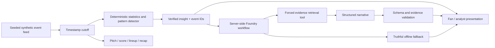

# Second Look

**You saw the game. Here’s what you missed.**

Second Look is a second-screen football intelligence experience. It turns synthetic match events into a small number of explainable stories, then lets viewers inspect the actions behind each claim. Built for an individual entry in Microsoft’s 2026 Inside the Game Developer Hackathon.

## The problem

Watching football and understanding how a match is changing are different things. A wall of statistics does little to bridge that gap. Second Look connects an observation, its supporting events, a tactical visualization, and a cautious explanation in one interaction.

## What works

- A responsive match centre with original Harbor Athletic and Riverside FC identities, alongside the supplied Second Look v1 brand system. No club crests, player photos, or broadcast footage.
- Three deterministic seeded fixtures: increasing pressure, post-substitution changes, and a quiet match.
- Play/pause, restart, seek, five playback speeds, scenario selection, and repeatable demo reset at 63:24.
- An interactive SVG pitch: actual event positions, numbered possession sequences, pass/shot endpoints, and progressive sequence replay. No invented tracking.
- Event-derived score, attempts, shots on target, pass completion, high ball wins, and synthetic chance probabilities.
- Pattern detection for attacking-third ball wins, shot frequency, and passing activity, with equal 15-minute comparison windows and supporting event IDs.
- Fan mode, analyst mode, timestamp-safe Catch Me Up, lineups, and player action maps.
- Device-local team, player, mode, and insight category preferences that filter and reorder observations.
- A real server-side Microsoft Foundry Responses API integration with forced evidence-tool retrieval, structured narrative output, and validation. **Live credentials are not configured or verified in this implementation.**
- Explicit offline demonstration mode; request failures or invalid model output fall back to computed explanations without claiming AI generation.

## Run locally

Use Node.js **24 LTS** (CI and container target). Next.js 16.4 requires at least Node 20.9; this project supports Node 22–26. Development was also checked on Node 26.

```sh
npm ci
cp .env.example .env.local
npm run dev
```

Open http://localhost:3000. No account, database, Azure service, or model key is needed for the offline demo.

```sh
npm run typecheck
npm test
npm run build
npx playwright install chromium
npm run test:e2e
```

The browser suite runs in desktop Chromium, Chromium with iPhone-sized viewport/touch emulation, and a compact Android-sized Chromium viewport. It audits the five main screens and both dialogs with axe, checks overflow, and exercises touch and keyboard pitch selection. It is not a real Safari-device certification. CI runs the optimized production server. For a production preview locally, run `npm run build && npm start`.

## Architecture



One client playback timestamp is the source of truth. Every derived view uses the event prefix at or before that time. The server independently regenerates the selected fixture and observation; it never trusts client-supplied metrics or evidence. No database or message broker is needed for a deterministic single-match demo.

| Code                            | Responsibility                                                                   |
| ------------------------------- | -------------------------------------------------------------------------------- |
| `src/lib/match.ts`              | Feed model, PRNG, fictional players, event generation, active lineup, statistics |
| `src/lib/intelligence.ts`       | Thresholded pattern discovery, evidence windows, mode-specific recap             |
| `src/lib/foundry.ts`            | Azure Responses API tool orchestration and narrative validation                  |
| `src/app/api/insights/route.ts` | Input validation, server recomputation, request coalescing, budget, fallback     |
| `src/components/`               | Responsive match experience and interactive SVG pitch                            |
| `tests/`, `e2e/`                | Data invariants, API contracts, model-tool mocks, browser journeys               |

## Synthetic data and explainability

The seed controls a reproducible event stream. Fictional teams exchange discrete possessions, pass among active teammates, and sometimes create shots, goals, corners, or fouls. Failed passes transfer at the recorded endpoint; fouls return the ball to the fouled team; goals restart at the centre; corners retain the attacking team. Restarts are not counted as high ball wins. Role-aware recipients and short recorded carries connect passes to shot locations. Chance probabilities fall with distance from goal. A substitution replaces an active player at the next possession boundary after 55 minutes. Scenario parameters alter probabilities, **not insight text or detection rules**. The pressure fixture uses seed 202632; the opening demo state has Harbor ahead 1–0 and evidence-supported pressure/chance observations.

Coordinates use 0–100 with each team's attack normalized left to right. The pitch mirrors Riverside when showing both teams. Only recorded events are drawn; lines represent recorded pass/shot endpoints. They do not claim continuous trajectories, ball speed, player speed, or off-ball positions. Possession IDs define sequence boundaries. The synthetic model simplifies stoppages and possession exchanges; it is not calibrated to a professional event-data distribution. Match time is a simplified 90-minute event clock without added time or a halftime break.

`MatchEvent` is the future licensed-feed integration boundary. An adapter would need to normalize coordinates, player/team identity, clock semantics, outcomes, and possession IDs. No real data provider is currently integrated.

Every insight contains category, team, headline, explanation, significance, what to watch, metric, current/baseline counts, both evidence ID sets, and window boundaries. Detectors use descriptive count thresholds, not statistical significance tests. They require enough observations and a meaningful change; no patterns appear before two complete windows are available. The quiet fixture has no qualifying observation at the demo timestamp. xG is the generator’s shot probability, not a trained expected-goals model. Passing activity is not mislabeled possession percentage.

## Brand and Phase 2 refinements

The supplied Second Look v1 kit is integrated without redrawing its mark. Navigation uses the supplied horizontal wordmark, with the symbol in the compact sidebar. Inter is self-hosted with `next/font/local`; runtime and builds do not request Google Fonts. Brand tokens, navy pitch surfaces, blue actions, green focused events, and original social assets are wired throughout the app. Guidelines and source tokens are preserved in `docs/brand/`.

Metadata serves the supplied SVG/ICO favicons, Apple touch icon, Safari mask, 192/512 px icons, maskable icon, 1200×630 Open Graph image, and 1200×675 X image. Set **`NEXT_PUBLIC_SITE_URL` to the public HTTPS origin before a hosted build**. Local builds default to localhost. A manifest supports home-screen identity; no offline service-worker support is claimed. Real external social link previews still need a public deployment.

The evidence inspector offers a readable event summary and a native event picker alongside touch/keyboard pitch markers. Replays follow recorded time gaps at 8× speed and hold the final frame. The selected evidence event determines the replay. On mobile, the insight detail follows the cards before the event feed. The original navigation, modes, stats, lineups, preferences, player maps, and Catch Me Up remain available.

**Watch the build-up** restores the pressure fixture and starts at 60:00 at 16×. High-ball-win evidence qualifies shortly afterward; the default 63:24 view has Harbor ahead 1–0 with four high ball wins and four shots in the recent window, each versus zero in the previous window. **Reset demo** restores that view, Fan mode, all categories, neutral preferences, and 8× playback. Catch Me Up avoids duplicating scoring shots as separate highlights and ends with a full-time message when appropriate.

## Microsoft Foundry: actual integration vs offline behavior

Deterministic code handles all ingestion, statistics, pattern discovery, recap text, rendering, and preferences. Microsoft Foundry powers **optional on-demand interpretation of a verified insight**. Click **Explain with Microsoft Foundry** after configuring it. Playback itself never sends model requests.

1. **Observe:** deterministic detector proposes a supported change.
2. **Retrieve:** the model must call `get_verified_evidence` for the selected insight. The server rejects any other ID or tool name.
3. **Narrate:** verified statistics, bounded events, and limitations are sent as a tool result; the second response must conform to a JSON schema.
4. **Validate:** Zod validates shape and lengths; supporting IDs must exactly match; digit/percentage claims are rejected because numbers are rendered directly from deterministic metrics.
5. **Present:** successfully validated responses are labeled Microsoft Foundry. Unavailable or invalid responses retain a clearly labeled deterministic explanation.

This is purposeful, bounded tool orchestration, not a set of autonomous agents. The statistical layer determines which stories deserve narration; the model retrieves evidence and adapts the interpretation to the audience. Schema and ID checks **do not prove semantic truth** of free-form prose. Human review of real Foundry outputs remains a pre-submission requirement.

Two requests maximum per narration, bounded output tokens, 25-second timeout per request, request coalescing, a one-hour cache, at most 100 cache entries, and a default 30 uncached narrations/hour/process limit control demo costs. Failed promises remain cached for that window to avoid repeated paid retries. Rewinds do not trigger network calls. Exact timestamp + scenario + audience + category + team is the cache key. Limits are process-local and reset on restart: use one instance for the hackathon. Before public scaling, add gateway-level quotas and Azure budgets; the current limiter is not a billing ceiling.

### Environment

| Variable               | Value                                                                                               |
| ---------------------- | --------------------------------------------------------------------------------------------------- |
| `FOUNDRY_ENABLED`      | `false` by default; explicitly set `true` to allow model calls                                      |
| `FOUNDRY_ENDPOINT`     | Azure OpenAI resource root, e.g. `https://RESOURCE.openai.azure.com`                                |
| `FOUNDRY_DEPLOYMENT`   | Name of a deployed model that supports Responses, tools, and structured outputs                     |
| `FOUNDRY_API_KEY`      | Resource key, server-only; never use a `NEXT_PUBLIC_` prefix                                        |
| `FOUNDRY_HOURLY_LIMIT` | Default `30`, capped at `100` uncached narrations per process per hour; `0` disables new narrations |

Use an **Azure OpenAI resource endpoint for a model deployed through Foundry**, not the Foundry portal URL. Resource API-key authentication is implemented; managed identity and Foundry project Entra authentication are not implemented. Store local values in ignored `.env.local`, and deployed values in App Service settings. The header says “Foundry configured” when configuration is present, not that a model call has succeeded.

## Azure deployment

Deployment has **not** been performed. Azure CLI was unauthenticated; the owner requested instructions for now. No resources or recurring charges were created. See [the deployment runbook](docs/DEPLOYMENT.md).

Included:

- GitHub Actions checks on PRs and feature/main pushes.
- A manual deployment workflow for an **existing** Azure App Service, with type checks, unit tests, production build, browser tests, and public URL checks.
- A Next.js standalone multi-stage Node 24 Dockerfile, running as a non-root user.

## Hackathon context

Primary target: overall prize. Secondary target: Best Use of Microsoft Foundry. The [official rules](https://github.com/microsoft/insidethegamehackathon/blob/main/OFFICIAL%20RULES.md) were reviewed October 9, 2026. Their five equally weighted judging criteria map to the synthetic feed and tests, evidence-first tool workflow, second-screen utility, responsive experience, and Microsoft integration. Registration ends October 20 at noon Pacific; submission ends October 27 at 11:59 p.m. Pacific. Video must be less than two minutes; repository must be public; judges need free access through the judging period.

Read [submission preparation](docs/SUBMISSION.md) for the pitch, demo flow, 90-second script, and remaining steps. This implementation is ready for local refinement, **not a claim of a submitted or cloud-verified entry**.

## Known limits and next work

- Configure Foundry and verify real model responses and narration quality before recording an AI demonstration.
- Deploy and verify the public Azure URL; test on actual mobile Safari and run an accessibility audit.
- The feed simplifies football mechanics and only detects three pattern families; validate it with football domain review.
- No audio, multilingual narratives, external provider, authentication, or persisted cross-device preferences.
- The recap is currently deterministic even when Foundry is enabled. No claim of an AI-generated recap is made.
- Consider a measured substitution comparison detector and exportable broadcast insight JSON as follow-up refinements.

Original application graphics are SVG/CSS. UI symbols use Lucide (ISC license); third-party library licenses remain applicable. No affiliation with fictional teams is implied, and no official league branding is reproduced.
