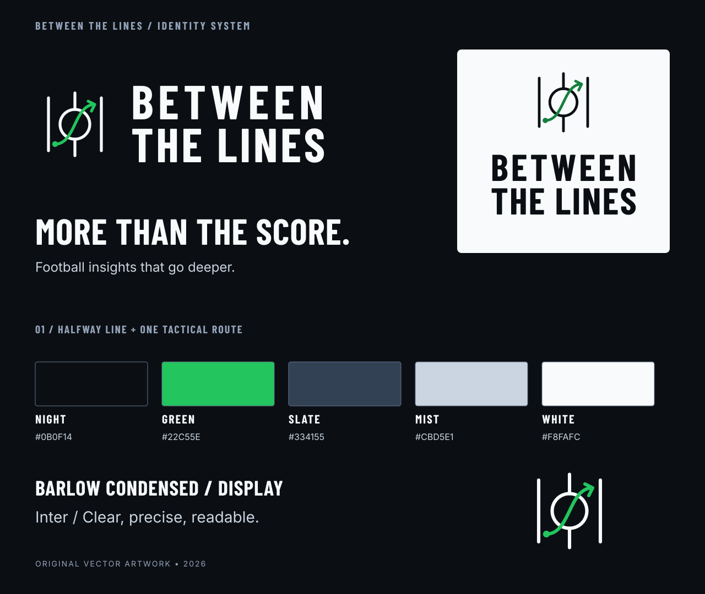
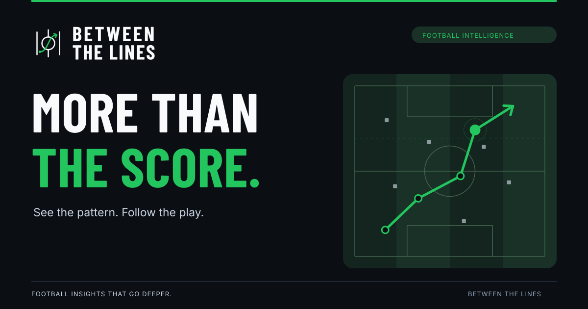

# Between the Lines — brand system

**More than the score.**
Football insights that go deeper.

## Brand overview and positioning

Between the Lines is a premium football intelligence experience that reveals the patterns, decisions, and stories behind the score. Match events become meaningful, evidence-backed insights through interactive visual storytelling and optional AI narration. The present application demonstrates this with synthetic fixtures and fictional clubs; the identity must never imply licensed live football coverage.

We serve curious football fans first, with the precision analysts, broadcasters, streaming experiences, and sports technology teams need. Be intelligent, confident, athletic, contemporary, precise, and approachable. A quiet interface lets the football and evidence carry the story.

Product: **Between the Lines**. Short name: **BTL**. Sentence case in prose; uppercase in the outlined wordmark. The primary tagline is **More than the score.** The supporting message is **Football insights that go deeper.** Keep the punctuation in prose. Do not abbreviate the public product name to “Between” or “The Lines.”

## Logo rationale and construction

The mark brings three football field lines together around a center circle. A single green route passes through the circle and exits forward. Its starting node is an observed event; the route makes that event part of a larger pattern. This is a tactical symbol, not a club crest or a literal complete pitch.

Three directions were evaluated: a framed half-pitch (too detailed at favicon sizes), a BTL monogram (less football-specific), and the open halfway-line symbol (selected for legibility, balance, and direct football relevance). The chosen artwork is newly constructed vector geometry, not a crop or tracing of the concept board.

The symbol uses a 96-unit square. Touchlines sit at x=16 and x=80, y=16–80. The halfway line sits at x=48, y=10–86, interrupted by an 18-unit-radius center circle at (48,48). Standard strokes are 3.5 units with round caps and joins. The route runs from (24,72) to (72,24), with one terminal arrow. The node is 7 units in diameter. Navigation marks retain the original construction. Browser icons use a dedicated 32-unit optical drawing with two touchlines, a center circle, and a diagonal route; the center stem is omitted to avoid crowding at 16px. App icons use a Midnight symbol on a Pitch Green tile, with a green knockout separating the route from the field lines. Do not add tactical crosses inside the logo; they belong in supporting compositions.

Source of truth: [`scripts/generate-brand.mjs`](../../scripts/generate-brand.mjs). All exported typography is outlined; fonts need not be installed to render an SVG. Rebuild with `npm ci && npm run brand:build`. PNGs derive directly from those SVGs. The font licenses are included beside this guide.

## Logo family and usage

| Variant     | Source / example                                                                                                         | Use                                      | Minimum rendered size                   |
| ----------- | ------------------------------------------------------------------------------------------------------------------------ | ---------------------------------------- | --------------------------------------- |
| Horizontal  | [Dark surface](../../public/brand/btl-horizontal-dark.svg), [light surface](../../public/brand/btl-horizontal-light.svg) | Navigation, headers, partnership lockups | 128px wide; prefer 150–180px in app UI  |
| Stacked     | [Dark surface](../../public/brand/btl-stacked-dark.svg), [light surface](../../public/brand/btl-stacked-light.svg)       | Covers, vertical placements              | 160px wide                              |
| Symbol      | [Dark surface](../../public/brand/btl-mark-dark.svg), [light surface](../../public/brand/btl-mark-light.svg)             | Compact sidebar, empty states            | 32px square; prefer 48–56px             |
| Compact BTL | [Dark surface](../../public/brand/btl-compact-dark.svg)                                                                  | Narrow editorial labels                  | 96px wide                               |
| Monochrome  | [White](../../public/brand/btl-horizontal-white.svg), [black](../../public/brand/btl-horizontal-black.svg)               | Single-color reproduction                | Same limits as full-color               |
| Small size  | [Favicon](../../public/favicon.svg)                                                                                      | Favicons, app icons                      | 16px; use supplied optical variant only |

Every family has dark-surface, light-surface, white, and black SVG and transparent PNG exports. “Dark” means light ink for a dark background, not dark-colored ink. See the [complete inventory](asset-inventory.json) for dimensions, roles, and file sizes.

Clear space: keep one quarter of the symbol width (24 construction units) around the mark or full lockup, measured from visible ink. On a 48px symbol, allow 12px on each side. The SVG viewport is not a substitute for layout padding. The maskable icon has its foreground within the central 80% safe circle; do not crop an ordinary icon into a maskable one.

Use the supplied optical variants for browser and install icons. Apple touch artwork is opaque and square so the operating system supplies its own corner mask; maskable artwork keeps the entire symbol within the central safe circle. Never stretch, rotate, add shadows, add gradients, alter export spacing, place on a busy photograph, or recolor the route with a club color. Never use a low-contrast green wordmark on a green pitch. Never substitute an emoji, football clip art, shield, or icon-library glyph for the mark.

## Color and semantic roles

| Color            | Hex                   | Role                                                                 |
| ---------------- | --------------------- | -------------------------------------------------------------------- |
| Midnight         | `#0B0F14`             | Dominant background, action text on green                            |
| Pitch Green      | `#22C55E`             | Primary actions, selected states, tactical emphasis on dark surfaces |
| Slate            | `#334155`             | Graphic construction lines and secondary surfaces                    |
| Mist             | `#CBD5E1`             | Supporting brand copy and light detail                               |
| Porcelain        | `#F8FAFC`             | Primary text on dark; light-mode canvas                              |
| Elevated navy    | `#111923`             | Panels                                                               |
| Raised slate     | `#1D2936`             | Controls and elevated surfaces                                       |
| Muted ink        | `#BAC5D3`             | Dark-mode secondary text                                             |
| Accessible green | `#15803D`             | Light-mode actions and green text                                    |
| Amber            | `#F3AB44` / `#895700` | Warning on dark / light                                              |
| Coral            | `#FF6275` / `#B52C43` | Error on dark / light                                                |

Green is meaningful, not a surface wash. Most of the interface stays neutral. Dark actions use Midnight labels on Pitch Green; light actions use white labels on Accessible Green. Hover uses `#4ADE80` (dark) or `#166534` (light). Focus is a 2px green outline with 4px offset. Selected navigation also changes background and weight; selected evidence has a border, not just a color change. Disabled controls retain native disabled semantics.

Light-mode supporting ink is `#475569`, controls `#E9EEF3`, panels white, selection `#E1EEE5`. Border contrast is decorative; essential inputs also use stronger control borders. Tokens live in [`src/app/brand-tokens.css`](../../src/app/brand-tokens.css). Legacy `--sl-*` variable names are intentionally retained for compatibility. The JSON token reference is [brand-tokens.json](brand-tokens.json).

Team identity remains independent of action semantics: Harbor blue, Riverside coral. Circles and squares, labels and event glyphs distinguish teams and categories. Shots use the shot glyph; recoveries the ball-win glyph; passes directional connections. Never color an opponent's selected event green in a way that loses team identity. Grass stays a muted natural green, separate from the brighter action accent.

## Typography

**Inter** is the primary application typeface, self-hosted variable weight, `font-display: swap`. **Barlow Condensed Bold** is the complementary display face: structured, compact, athletic. It is limited to the logo, campaign headlines, and scoreboard numbers. Both are distributed under the SIL Open Font License; see [Inter](Inter-OFL.txt) and [Barlow](Barlow-OFL.txt). Exported wordmarks are paths.

| Role                    | Size                        | Weight        | Line height / tracking               |
| ----------------------- | --------------------------- | ------------- | ------------------------------------ |
| Campaign headline       | 64–142px in artwork         | Barlow 700    | 0.98–1.08; slight positive tracking  |
| Branded dialog headline | 32–48px responsive          | Barlow 700    | 1.05; .02em                          |
| Main app heading        | Existing responsive 26–36px | Inter 650     | Compact; sentence case               |
| Scoreboard              | 38px                        | Barlow 700    | Tabular numerals                     |
| Body / explanation      | 15px                        | Inter 400     | 1.65–1.75                            |
| Navigation / controls   | 14px                     | Inter 400–650 | Preserve established touch padding   |
| Supporting labels       | 12–13px                     | Inter 400–600 | Readable contrast; short labels only |
| Eyebrows                | 12px                     | Inter 600     | 1–1.7px tracking; uppercase          |

Numeric UI uses tabular figures to avoid horizontal movement as the clock or score changes. Small labels have a 12px minimum, controls are 14px, and supporting paragraphs are 14–15px. At narrow mobile widths, controls wrap instead of shrinking. Keep uppercase for short labels, not explanatory paragraphs. Preserve the mobile reading hierarchy and do not shrink copy to force content onto one line. The supporting message is never appended to a tiny navigation logo.

## Iconography and player identity

Preserve the existing Lucide / Tabler selection, custom football glyphs, player-number treatment, and original Harbor/Riverside marks. Do not introduce another family. Standard controls use 16–24px icons with consistent strokes; the brand symbol is separate artwork. See [visual asset rules](VISUAL-ASSETS.md) for the retained glyph catalog and licenses. Football markers keep team shapes, player numbers, and accessible labels.

## Signature graphics

Use pitch geometry, one connected route, a highlighted observation, and quiet coordinate-like labels. A full social composition may include a handful of opposing crosses and route nodes. In the product, use actual event coordinates and recorded sequences; decorative marketing routes must never masquerade as match evidence. Empty states use the symbol alongside a plain explanation of missing evidence.

Keep routes thin, field markings quieter, and the observed moment strongest. Avoid texture, glow, photorealistic stock football, club imagery, and ornamental chart furniture. The social compositions are entirely original vectors; no photography, league marks, player likenesses, or licensed match footage are included.

## Motion

Retain the existing replay clock, event transitions, selection motion, cancellation, and reduced-motion behavior. Existing loading progress uses the green accent as a restrained tactical line. Empty-state brand marks stay static: animating them continually would imply observation activity without new evidence. An animated entrance was considered but omitted to avoid introducing a splash screen or delaying controls. If a future campaign needs logo motion, reveal pitch geometry, then the route, then the node, once in 400–700ms. With reduced motion, show the completed mark immediately. Never animate score values independently of their underlying state. See the retained [motion system](../motion/README.md).

## Voice and messaging

Be confident about observations and cautious about interpretations. Lead with the football, then evidence, then what to watch. Prefer “Harbor are winning the ball higher up the pitch” to “Our AI has detected elite tactical dominance.” Say when a fixture is synthetic and when narration is offline. Never invent causal claims or advertise an unverified provider capability. Use “More than the score.” for the primary campaign. Use “Football insights that go deeper.” to explain its value.

## Social and video standards

| Format      | Export                                              | Composition                                     |
| ----------- | --------------------------------------------------- | ----------------------------------------------- |
| Open Graph  | [1200 × 630](../../public/opengraph-image.png)      | Logo and headline left; tactical pitch right    |
| X / Twitter | [1200 × 675](../../public/twitter-image.png)        | Wide composition with extra vertical room       |
| Square      | [1080 × 1080](../../public/brand/social-square.png) | Stacked headline above a landscape tactical field |
| Story       | [1080 × 1920](../../public/brand/social-story.png)  | Vertical headline, full tactical field below    |
| Video title | [1920 × 1080](../../public/brand/video-title.png)   | Broadcast title / demo opening or closing frame |

The refreshed family uses the established logo, a bold two-line campaign headline, the supporting line “See the pattern. Follow the play.”, and a contained tactical illustration. Pitch circles and route markers retain their proportions across formats. These routes are illustrative artwork, not match evidence. [Review the share and icon contact sheet](meta-assets-preview.png).

Matching SVG sources live in `public/brand/`. Essential copy stays at least 64 units from wide-art edges and well inside the story edges. The story logo is decorative identity at the top; the main headline and supporting message sit away from overlay controls. Check platform crop previews when publishing. Supply meaningful alt text describing the headline and field route. Never add a real Premier League mark or imply affiliation beyond accurate hackathon wording.

## Accessibility and implementation

Primary action pairs meet WCAG AA 4.5:1 for ordinary text, covered by tests. Do not use Pitch Green with white body text. Both light and dark themes retain contrast, focus rings, descriptive labels, live score announcements, keyboard pitch controls, and reduced motion. A linked logo has the accessible name “Between the Lines home”; its image has the correct product alt text. Only one themed logo is visible at a time.

Metadata is centralized in [`src/lib/brand.ts`](../../src/lib/brand.ts). Icon and share URLs include the shared version from [`src/lib/brand-assets.ts`](../../src/lib/brand-assets.ts); bump it whenever replacing the artwork to give browsers and social crawlers a fresh asset URL. Existing social posts can still retain platform-side caches. It includes the full title, child title template, description, canonical, Open Graph, Twitter, icons, manifest and Apple install identity. Theme colors follow actual appearance. The existing public Workers origin remains the default; `NEXT_PUBLIC_SITE_URL`, then `APP_URL`, can override it. No new domain was invented. Preference keys, Redis keys, Worker service, npm package and GitHub repository remain stable.

## Review and delivery

See [review evidence and limitations](REVIEW.md), [all export dimensions](asset-inventory.json), and [manual submission copy](../SUBMISSION.md). The prior identity survives only in deliberately labeled historical comparisons and Git history. No Innovation Studio account or submission is modified by this work.
