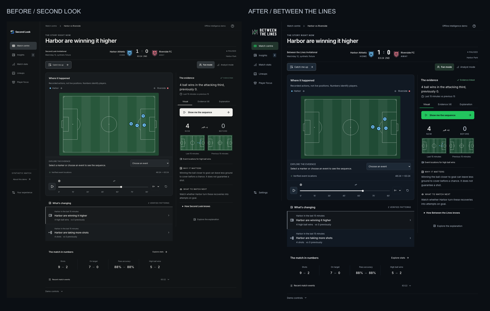

# Between the Lines — implementation review

The rebrand preserves the existing match simulation, AI adapters and validation, original fictional clubs, football icons, event inspection, sequence replay, preferences, light/dark appearance, and motion system. The pre-existing local refinements were saved in checkpoint commit `2ad36b2` before branding work began on `codex/between-the-lines`, based on `origin/main` at `e3a9857`.

The final sidebar footer contains only Settings. The redundant promotional block was removed following review. Navigation and controls are 14px; supporting copy is 14–15px; small interface labels have a 12px floor, including the formerly 8px evidence label. Secondary dark-mode text is brighter. Narrow mobile toolbars wrap rather than reducing text size.

## Identity and comparison

- [Identity preview](identity-preview.png)
- [Guidelines](README.md)
- [Complete human-readable inventory](ASSETS.md) and [machine-readable dimensions](asset-inventory.json): 58 generated assets
- [Updated manual submission copy and demo script](../SUBMISSION.md)

The left image is the app with the preserved local refinements and its old identity. The right is the rebrand. Baseline images intentionally contain the old name. Original full-size baselines: [desktop](review/before-desktop.png), [mobile](review/before-mobile.png).

## Responsive screenshots

All screenshots use the actual running app at its default paused synthetic fixture. These are Chromium viewport/touch emulations, not photographs or tests on physical phones. The review includes reduced motion for stable screenshots; the browser suite separately exercises ordinary and reduced motion.

| Viewport                  | Dark appearance                      | Light appearance                      |
| ------------------------- | ------------------------------------ | ------------------------------------- |
| 1920 × 1080 desktop       | [View](review/desktop-1920-dark.png) | [View](review/desktop-1920-light.png) |
| 1440 × 1100 desktop       | [View](review/desktop-1440-dark.png) | [View](review/desktop-1440-light.png) |
| 834 × 1112 tablet         | [View](review/tablet-dark.png)       | [View](review/tablet-light.png)       |
| 390 × 844 iPhone size     | [View](review/iphone-dark.png)       | [View](review/iphone-light.png)       |
| 360 × 800 compact Android | [View](review/android-dark.png)      | [View](review/android-light.png)      |
| 320 × 740 small mobile    | [View](review/mobile-320-dark.png)   | [View](review/mobile-320-light.png)   |

[Machine-readable review results](review/results.json): every combination has one visible brand logo, no horizontal page overflow, no page errors, and zero axe WCAG 2 A/AA / 2.1 AA violations in the audited match view. This is automated coverage, not a complete accessibility certification. Existing browser tests also cover the other main sections, dialogs, keyboard navigation, replay, and appearance persistence.

## Metadata and assets

Title and child title template, application name, description, canonical URL, Open Graph, Twitter cards, manifest, Apple install identity, themed browser colors and all icons are integrated. SVG/ICO/PNG favicons exist; all manifest paths resolve. Targeted tests inspect rendered metadata and actual image responses. Tests validate every PNG dimension against the export inventory and verify that source SVGs contain outlined lettering rather than live text or embedded raster artwork. Primary action pairs are tested for 4.5:1 contrast in both appearances.

The default public origin remains the existing `https://second-look.sybgm6dkhk.workers.dev`; host environment configuration takes priority. No new domain or repository name is assumed. Full-color, monochrome, horizontal, stacked, compact, and symbol variants are available. Small icons use heavier simplified geometry; maskable artwork stays inside the safe circle. Social assets include 1200×630, 1200×675, 1080×1080, 1080×1920 and 1920×1080 compositions. Both font licenses ship in the repository.

## Verification

- TypeScript / Next route generation and production build pass locally.
- Unit and integration suite: 118 passed locally; the real Redis test is skipped without a local Redis server. CI supplies Redis and runs that test.
- Full browser suite covers 75 tests across desktop, Android-size and iPhone-size Chromium, including branding, metadata, readability, accessibility, appearance, match functionality, and motion. Pull-request CI is the final merge gate and repeats the suite against both standalone Next.js and the Cloudflare bundle.
- Cloudflare/OpenNext production packaging has been built locally; CI repeats the build, Worker dry run, and browser suite against the final commit.
- No paid provider calls, deployment, video publication, hackathon submission, or Innovation Studio account changes are performed by this task.

Reproduce assets with `npm run brand:build`. Reproduce screenshots with `BRAND_REVIEW_URL=http://127.0.0.1:3000 npm run brand:review` against a running app. The asset generator uses bundled fonts and Sharp, with no remote image or font dependency.

## Remaining operational checks

Inspect physical iOS/Safari and Android devices before recording a final demo. Verify platform-specific social crops and clear any previously cached preview on the deployed host after release. Installed home-screen icons may need refresh/reinstallation. Live Foundry quality validation and Azure deployment remain separate tasks; this work does not claim either is newly verified.

## Intentional historical references

The README explains the former product name. The npm package, GitHub repository, Worker service/domain, saved preference keys, Redis namespaces, test prefixes, and temporary deployment paths retain `second-look` for compatibility. Earlier AI screenshots, the old asset contact sheet, and motion videos are labeled historical. Unreferenced old logos and the obsolete PDF guide were removed from the current tree; Git history preserves them. Source application copy, currently served public brand files, and active demo preparation copy use Between the Lines.
