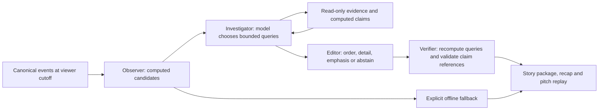

# AI Match Director 1.0

The director adds event relationships, bounded investigation, editorial selection and reusable verified stories to the existing match experience. It preserves canonical sources, the earlier detectors and explanation endpoints, provider adapters, Redis quotas, deterministic fallbacks and the visual/motion system. No paid call, deployment or inference enablement was performed in this sprint.

## Audit of the previous workflow

The previous observer discovers changes in high recoveries, shots and pass attempts. Its two-request AI workflow retrieves a fixed evidence packet and selects up to four existing fact IDs; the server supplies required score/goal context and renders approved sentences. The model does not discover candidates, ask follow-up evidence questions or author factual prose. Reliable identity/count/cutoff checks provide value independently of AI. A model call adds only ordering/selection; it is unnecessary for a quiet opening or routine arithmetic. There is no evidence yet that the old or new model-directed editorial choices outperform the deterministic baseline. Earlier live results in `../AI-EVALUATION.md` belong to the previous workflow.

## Architecture and actual responsibilities



These are logical responsibilities in one workflow, not separate agent personas. The model chooses tools, players and windows, explores another explanation on a second turn, selects newly computed claims, prioritizes up to two Fan or three Analyst stories, chooses brief/detailed language and a compatible visualization, or abstains. Statistics, thresholds, identities, relationship grammar and verification remain deterministic.

**Language boundary:** the model authors the investigation and editorial plan, not arbitrary factual prose. Claim references alone cannot validate a generated sentence. The renderer constrains factual language to computed claim forms. This intentionally limits linguistic freedom; novel free-form explanation is not implemented or claimed. Narrative quality and editorial benefit require human/live evaluation.

## Story discovery

- Recoveries followed by shots in the same team, period and possession, within 30 recorded seconds. Failed winning attempts do not qualify. Minute-precision sources do not produce elapsed-second claims.
- At least four completed passes in a recorded possession before a shot.
- Repeated directional passing pairs, only with supported recipients and known identities.
- Incoming players' recorded contributions after substitutions, without attributing causation.
- Equal-window changes in shots, attacking-third activity and normalized forward passes, wholly inside one period.
- Changes in mean shot-origin x with at least three located shots in each window. This is not xG or distance to goal.
- Investigation-selected player contributions and shot/pass count comparisons over model-selected equal windows. These claims need not be on the initial observer shortlist.

Source possession capabilities, actor identity and time precision gate observations. Recoveries, recipients and substitutions are not invented for sources lacking them. Existing historical detectors remain available where these richer relationships cannot be supported. Numerical ranks are transparent heuristics, not confidence probabilities. A quiet scenario can still contain a qualifying recorded passage; no-events input and the quiet ending abstain.

## Evidence tools

All seven tools enforce server-selected match identity, strict input validation, an immutable cutoff, bounded windows, read-only operation and provenance:

| Tool                     | Output / restriction                                                                             |
| ------------------------ | ------------------------------------------------------------------------------------------------ |
| `get_match_events`       | At most 40 event summaries; total count and truncation explicit                                  |
| `get_team_statistics`    | Aggregate counts and known pass-outcome denominator                                              |
| `get_player_involvement` | Known player's actions; can compute a new contribution claim                                     |
| `compare_time_windows`   | Immediately preceding equal window; both wholly in one period; can compute new comparison claims |
| `get_recorded_sequence`  | Known, visible anchor; same team/period/possession; unsupported possession rejected              |
| `get_shot_locations`     | Recorded shots and nullable locations                                                            |
| `get_match_context`      | Score computed from visible scoring events, capabilities, limitations                            |

A sequence query returns the complete bounded possession context up to its anchor, potentially starting before the requested interval; it is never truncated into an invented possession. Returned event lists cap at 40, claim evidence at 120 IDs and each serialized tool response at 48,000 characters. Aggregates cover all matching events even when displayed lists truncate. Related-event IDs are cutoff-filtered. No raw provider payload, final score, future events, infrastructure access or private model reasoning is exposed. Statistics are not accepted from the model.

The verifier creates a fresh investigation, replays the exact tool queries, recomputes the claim registry, and rejects unknown/unretrieved claims, arbitrary fields or prose, duplicate/overlapping stories, mismatched visualization relationships and inconsistent abstention.

## Application integration

`POST /api/director` accepts exactly one synthetic scenario or permitted historical fixture, cutoff, audience and preferences. Client-supplied event arrays are rejected. Catch Me Up calls this endpoint in both source experiences. Required score and latest goal remain server-owned context even if the model abstains. The existing legacy explanation routes remain supported for individual count detectors.

The relationship card sits inside the existing intelligence panel. It has replay, optional evidence/validation details and a broadcast preview, without new navigation. The evidence replay uses the established player identities, pitch and motion components. Offline computation is explicitly labelled. A model abstention hides the investigated relationship instead of replacing it with a falsely labelled AI story.

Proactive inference requires **both** existing provider enablement and `AI_PROACTIVE_ENABLED=true`. It remains false by default. No settings or credentials were activated. Playback only considers new candidate episodes, importance rank >=7, a 60-second attempt cooldown, existing server quotas and stale request cancellation. Exact-cutoff cached answers cannot appear before their cutoff; answers expire after 180 match seconds. Rewind, source, preference and audience changes invalidate work. Stable episode IDs and evidence overlap reduce repetition; this is in-memory viewing-session state, not a persistent personalization profile.

## Provider and cost boundaries

OpenAI and Foundry share tools, query runner, structured editorial schema and broadcast contract. OpenAI uses bearer authentication and the existing low reasoning-effort setting; Foundry uses its Azure resource `/openai/v1/responses` endpoint, `api-key` authentication and deployment name, without hardcoded OpenAI reasoning options. Project agent endpoints are not supported by this adapter. There is no cross-provider substitution.

Per uncached investigation: at most **three model requests**, **four tool calls**, **1,800 output tokens per request**, no automatic retries. The provider payload cap remains 131,072 bytes; director calls have 18-second per-request timeouts within the existing 70-second reservation lock. Existing limits count workflow reservations, not individual HTTP calls, so worst-case request count is now three times the configured workflow quota. Production remains fail-closed without TLS Redis. Concurrent identical requests use the shared lock; a second busy request falls back without duplicating inference.

Cache identity includes match ID, a full canonical-data digest, exact cutoff, audience, preferences/seen evidence, provider, model and director/prompt version. Metrics report request attempts, tool calls, latency, token usage, known-model cost estimates and cache status; a cache hit incurs zero new requests/cost. Failed attempts remain reserved and report unknown cost when usage cannot be established. The existing provider utility does not supply token counts for network failures.

At the checked GPT-5.4-mini standard rates ($0.75/M input, $0.075/M cached input, $4.50/M output), 10,000 uncached input plus 1,000 output tokens across a workflow would estimate **$0.012**. This is an illustrative total, not measured director usage or an invoice. Foundry cost stays unknown without deployment pricing. The six-request live harness reserves $0.11 per request using a deliberately conservative payload-byte/token envelope, including failures, under a proposed $0.70 allowance. Actual rates must be rechecked before authorization.

Official contracts checked October 9, 2026: [OpenAI function calling](https://developers.openai.com/api/docs/guides/function-calling), [GPT-5.4-mini pricing](https://developers.openai.com/api/docs/models/gpt-5.4-mini), [Azure Responses reference](https://learn.microsoft.com/en-us/rest/api/microsoft-foundry/azureopenai/responses).

**Verification status:** new OpenAI workflow tested with scripted transport only, not live; Microsoft Foundry adapter tested with scripted transport only, not live. Azure account access remains blocked by the reported Authenticator issue. Neither provider's narrative quality is claimed as verified.

## Broadcast contract

`BroadcastStory` in `src/lib/ai/director/story.ts` is versioned `1.0.0`; [broadcast-story.json](broadcast-story.json) is an independently consumable computed example. It contains story/match identity, source timestamp and viewer cutoff, headline, explanation, category, claim IDs, statistics, evidence IDs and coordinates, audience, suggested visualization and timing, source provenance, limitations, actual provider and verification status. Consumers must honor `presentation.earliest` and `expires` against their playback clock and must not relabel an offline package as live AI output. Coordinates use the canonical action-team orientation.

## Reproducible demonstration

1. Keep inference disabled. Open the synthetic pressure fixture at the default 63:24, or start earlier and play into a qualifying passage. Observer cards originate from generated events, not a scripted outcome list.
2. Read the recovery-to-shot story, open its evidence and replay the connected actions. Change Fan/Analyst mode to see the distinct language/detail. Seek backward before the events to verify visibility.
3. Open Broadcast story and download the exact verified package. The screenshots in this directory show **offline computation**, never a simulated live call.
4. After separate paid authorization, enable the chosen provider in an isolated process and use Investigate this passage or Catch Me Up. Tool traces in How we know show actual completed query names, time windows, returned counts and verified claim counts. A rejected response falls back visibly. Do not narrate tool activity that has not actually occurred.
5. Only after explicit authorization for autonomous inference, enable the separate proactive flag. The same computed candidates trigger bounded investigation during playback.

A completed live nine-stage demonstration and an editorial improvement claim remain pending authorized model calls and human review. No fabricated animation or mock output is presented as live inference.

## Evaluation and review

Run `npm run eval:director` for the free suite. `artifacts/director-evaluation.json` contains 200 cases: 3 synthetic scenarios × 4 seeds × 8 timestamps × 2 audiences, plus 8 permitted historical cases. Seeds 17, 8911 and 46003 use the balanced generator profile. It compares the old detector output with the new computed candidates, tests prefix invariance (removing all future events changes nothing), validates reference/coordinate membership, and records observer latency. Separate adversarial tests cover future/unknown events, wrong matches/actors, invalid comparisons, capabilities, unsupported prose, repeated claims, abstention, provider identity, caching and cancellation.

Scripted provider tests verify orchestration only. **Live quality improvement rate: unknown.** No automated interestingness score is used as evidence of improvement.

For human review, randomize baseline/director order and hide provider identity. Record reviewer/date and exact case. Treat any unsupported fact or causal/tactical implication as a blocking failure. Score these dimensions 1–5: relevance (does it matter now?), narrative clarity, evidence sufficiency, audience usefulness and novelty. Record repetition as none/minor/material, abstention as appropriate/missed-story/manufactured-story, and preference as AI/tie/baseline. A 1 means misleading or unusable; 3 means accurate but ordinary; 5 means distinctly useful and concise. Track wins / all reviewed pairs, ties separately, with raw counts; exclude no cases silently. Improvement is not established by a more interesting tone alone.

After approval for **at most six OpenAI requests and $0.70**, the separate harness is:

```sh
AI_ENABLED=true SECOND_LOOK_AUTHORIZE_DIRECTOR_LIVE=yes SECOND_LOOK_DIRECTOR_ALLOWANCE_USD=0.70 npm run eval:director:live
```

The authorization flag is read before local configuration and cannot be supplied implicitly by `.env.local`. It accepts only the budgeted OpenAI model, enforces request/spend reservations at transport dispatch, saves sanitized metrics and results, and never joins ordinary CI. This two-audience unfamiliar-seed run is a smoke test, not a statistically adequate benchmark. Expand to the full free-suite scenario matrix only with another approved allowance. Review the saved results using the rubric before enabling public inference.

## Remaining limitations

Constrained factual language is less expressive than free-form AI writing. Candidate thresholds are heuristic and not statistically calibrated. Dynamic questions are limited to implemented read-only tools and grammars; formation, intentions, off-ball movement and causal explanations are unavailable. Sequence tools require possession support, and no physical pitch-direction claim is possible. Long candidate evidence beyond the cap is conservatively omitted. Client novelty state is session-local. Live quality, live latency and actual token costs remain unmeasured for this version. P2 language expansion and advanced trained metrics are intentionally deferred.

## Verification artifacts

Local checks: type checking, 298 unit/API/integration assertions, production build, complete desktop/mobile browser coverage (with corrected cross-source layout assertions), and focused replay/broadcast/rewind checks. Two real-Redis tests are environment-gated locally and run against the disposable Redis service in CI. Browser tests include axe accessibility checks, dark mode, reduced motion, 320px layouts and historical replay. Screenshots: [desktop](desktop.png), [iPhone-sized](mobile.png), [Android-sized](android.png). [Evaluation summary](evaluation-summary.json) records the 200 free cases; full per-case output is uploaded by CI. Repository CI is the final merge gate.
